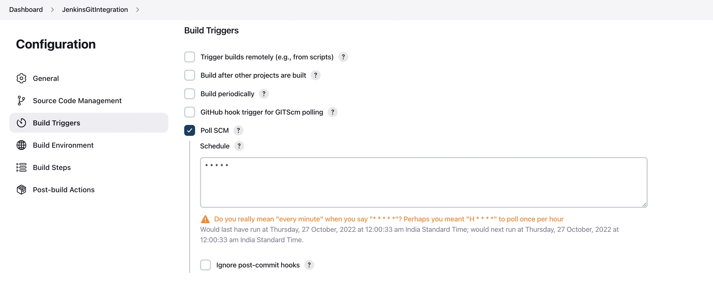

# Jenkins Git Integration (Java)

### Steps:

1. Create java program in local machine. (ex. source.java)
    ```java
       public class source{
          public static void main(String args[]){
              System.out.println("Sample java program to test Jenkins git integration");
          }
       }
    ```
  
2. Create git repository and push `source.java` code.

3. Login to Jenkins, create Freestyle project and provide git repository url (created in previous step).

    

4. In build triggers section check Poll SCM and provide 5 asterisk with space seperated meaning build project every minute.

    
    
5. In Build steps section select Execute shell (depends on os that your using) and provide the commands to build project sorce code.

    

6. Click Apply and Save.

7. Click on Build Now to run the project.
    
    
    
8. Final output will look like this.
    
    
